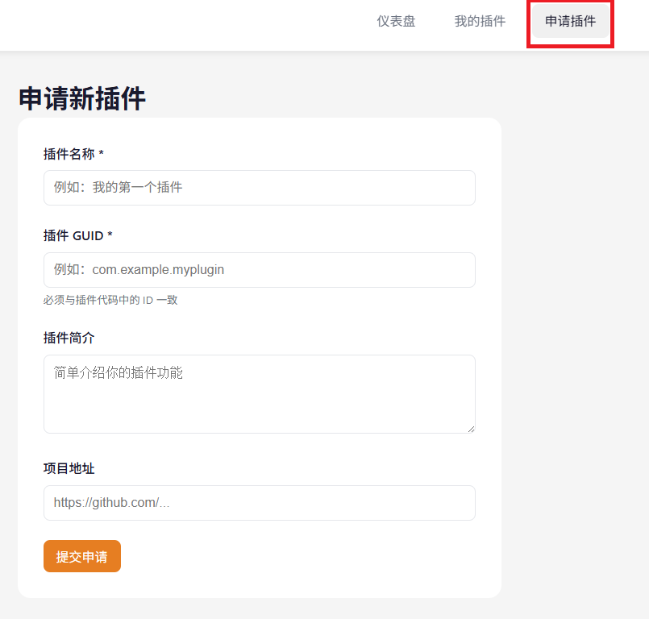
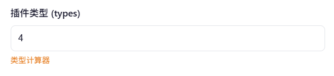

# 发布与版本管理

* 如果你希望把你的插件发布到PotatoVN插件市场，请从头到尾阅读本章节内容。
* 如果你希望自己分发插件，可以直接参考[插件包编译](/development/client-plugin/deploy-manage.html#插件包编译)。

## 插件包编译

首先，请修改编译模式为`release`，如下图所示（`RIDER`等其他IDE用户自行寻找相关调整位置，以下均以`visual studio`为例）：

右键插件项目，点击编译

插件编译出来的安装包会被放在插件项目目录下的`artifacts`文件夹内，文件名固定为：`plugin.pvnplugin.zip`，如果你计划自行分发插件的话，分发这个文件就好啦🎉。

## 登录插件平台并申请创建插件

登录[PotatoVN插件平台](https://plugin.potatovn.net)，使用PotatoVN账户（即平时你用来同步游戏的账户）进行登录。

进入平台后，对于每一个新的插件，你都需要申请创建一个新的插件项目，点击右上角的`创建插件`按钮，按照提示填写插件名称和简介后提交申请即可，一般来说，土豆会在3天之内审核你的插件申请~。

## 在平台上配置插件信息
审核通过后，你可以在“我的插件”界面中看到你刚刚创建的插件项目，点击进入插件项目详情页后，你就可以在“版本管理”界面中上传插件信息与插件包了。

按照你的插件内容填写插件信息后点击上传即可~

:::tip
`types` 字段表示插件的类型，是一个按位标识的 `int32_t` 值。你可以前往 [插件类型计算器](/development/client-plugin/type-calculator.html) 通过勾选类型来快速计算该值。

:::

:::tip
* 后续如果需要更新插件信息，只需更新插件信息即可~
* 插件信息与插件包是相互独立的，更新插件信息并不需要重新上传插件包，反之亦然。
:::

最后，把插件压缩包上传到`plugin`包中，版本号需要比之前的版本号更高（如果是第一次上传则随意填写一个版本号即可）。

:::tip
请注意，第一次上传插件包后需要等待土豆审核插件包通过后才能在软件的插件市场中看到你的插件，后续更新插件包就不需要审核啦。
:::

完成以上步骤后你应该就可以在PotatoVN软件的插件市场中看到你的插件啦🎉🎉🎉
