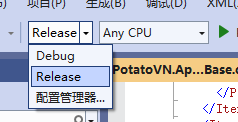
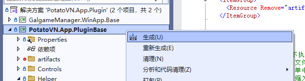
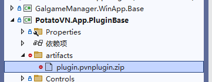
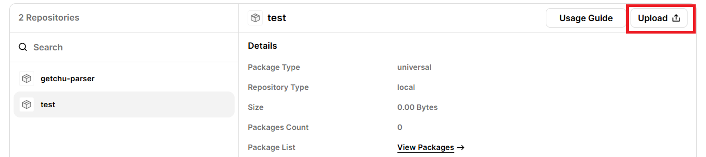
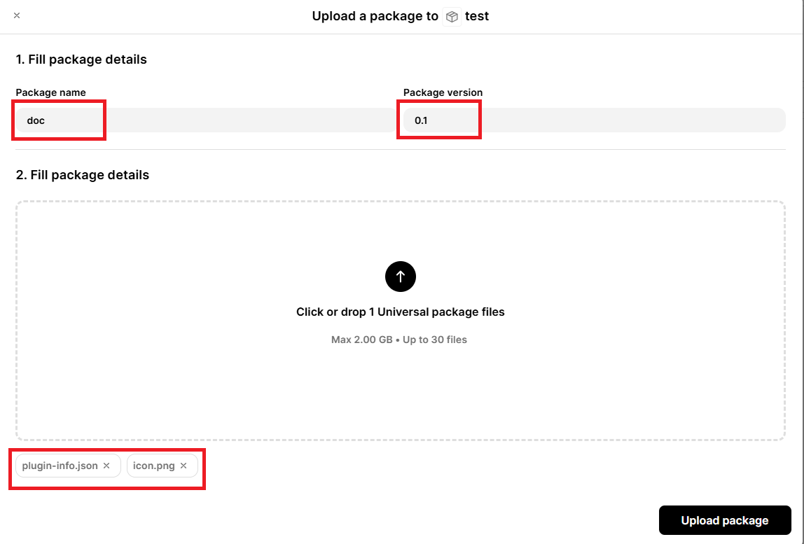
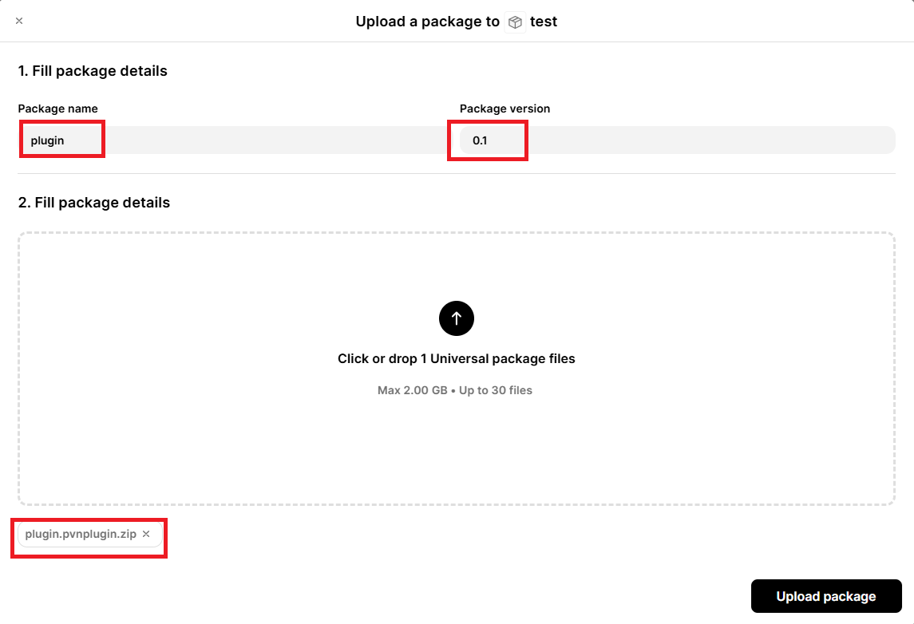

# 发布与版本管理

* 如果你希望把你的插件发布到PotatoVN插件市场，请参考第一次发布插件章节的内容。
* 如果你希望自己分发插件，可以直接参考[插件包编译](/development/client-plugin/deploy-manage.html#插件包编译)。

## 第一次发布插件

### 注册账号
在发布插件前，你需要在[PotatoVN 插件管理平台](https://plugin.api.potatovn.net/)上注册一个开发者账号，并创建你的插件项目。插件管理平台提供了上传、管理和发布插件的功能。

推荐直接点击Login按钮，使用[PotatoVN账号](https://account.potatovn.net/oidc-login)（也就是软件内云同步的账号）登录插件管理平台~


当然，不使用PotatoVN账号也可以，点击注册按钮，填写邮箱等信息注册一个新账号即可~

### 申请创建插件项目

完成注册后，请[邮件给土豆](mailto:goldenpotato137@gmail.com)来申请新建一个插件项目，可以参考以下模板（自行发挥也没问题哒😆）：
```markdown
# 主题: 上架PotatoVN插件市场申请
* 插件名称: <你的插件名称>
* 插件简介: <简单介绍你的插件>
* 插件项目地址: <如果有的话，填写你的插件项目地址>
* 其他信息: <如果有其他想说的内容，可以填写在这里>
```

土豆看到你的邮件后会帮你创建插件项目，并回复你，后续你就能在插件平台上看到自己的插件项目啦。


## 插件包编译

首先，请修改编译模式为`release`，如下图所示（`RIDER`等其他IDE用户自行寻找相关调整位置，以下均以`visual studio`为例）：



右键插件项目，点击编译


插件编译出来的安装包会被放在插件项目目录下的`artifacts`文件夹内，文件名固定为：`plugin.pvnplugin.zip`，如果你计划自行分发插件的话，分发这个文件就好啦🎉。


## 在平台上配置插件信息

::: warning
只有在插件平台上正确配置插件信息后，插件才能在软件的插件市场中显示。
:::

请你按照以下模板填入你的插件信息：
```json5
{
    "guid": "插件的ID，必须和插件代码里编码的ID一致",
    "name": "插件名称",
    "description_short": "这里的描述会被显示在插件列表的卡片里\n第二行描述~",
    "description_detailed": "这里的描述会被显示在点击插件卡片后弹出的插件详情对话框里\n第二行描述\n第三行描述",
    "icon": "icon.png",  //插件图标名，建议使用分辨率为256x256的png图片
    "developer": "开发者名称", //可以为空
    "developer_url": "https://开发者网址.com", //可以为空
    "project_url": "https://项目地址.com" //可以为空
}
```

完成插件信息`json`编写后，请把它命名为:`plugin-info.json`，并把它和插件图标文件一起上传到插件的`doc`包中（如下图所示）。



请把`plugin-info.json`和图标文件上传到`doc`包中，版本可以任填：


::: warning
请严格按照上述格式填写插件信息（使用`doc`这个包名以及包含`plugin-info.json`），否则插件将无法在插件市场中正确显示。
:::

:::tip
* 后续如果需要更新插件信息，只需重新上传新的`plugin-info.json`和图标文件，并使用更高的版本号即可。
* 插件信息与插件包是相互独立的，更新插件信息并不需要重新上传插件包，反之亦然。
:::

## 上传与更新插件

把插件压缩包上传到`plugin`包中，版本号需要比之前的版本号更高（如果是第一次上传则随意填写一个版本号即可）。



完成以上步骤后你应该就可以在PotatoVN软件的插件市场中看到你的插件啦🎉🎉🎉
