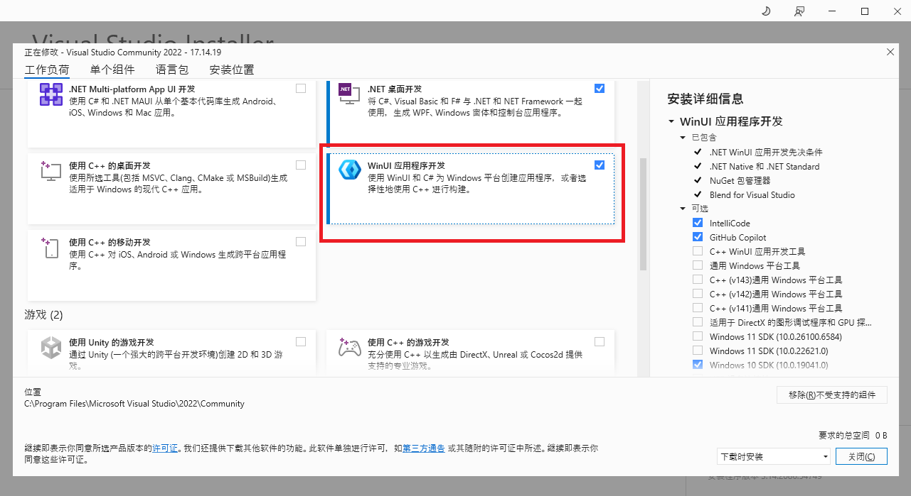

# 快速开始

让我们们开始吧，制作你的第一个 PotatoVN 插件！

## 安装开发环境

1.  下载并运行 [Visual Studio Installer](https://visualstudio.microsoft.com/downloads/)。
2.  在 "工作负载" 标签页下，如下图所示，选择**WinUI 应用程序开发**组件。
    

3.  完成安装。

安装完成后，你就可以使用 Visual Studio 来进行插件开发了。当然，使用其他支持 .NET 开发的 IDE (例如 JetBrains Rider) 也是完全可行的。


## 使用插件模板快速启动

接下来，使用 GitHub 模板生成一个插件项目，编译项目，并在应用中使用编译出来的插件。

1. **从模板创建项目**:
    访问 [PotatoVN.App.PluginBase 模板仓库](https://github.com/GoldenPotato137/PotatoVN.App.PluginBase) 并点击 "Use this template" -> "Create a new repository" 来创建一个你自己的插件项目。

2. **克隆并初始化项目**:
    使用 Git 克隆你刚刚创建的仓库到本地。然后，在项目根目录运行以下命令来初始化并拉取 `git submodule` (应用公开库使用submodule挂载到插件中):
    ```bash
    git submodule update --init --recursive
    ```

3. **编译项目**:
    使用 Visual Studio (或你选择的 IDE) 打开解决方案 (`.sln` 文件)。右键项目`PotatoVN.App.PluginBase`，在弹出菜单中点击生成编译插件。
    

4. **打开开发者模式**：在应用的设置->其他设置中启用开发者模式，否则无法直接从编译出来的文件夹加载插件。

5. **在应用中启用插件**:
    打开 PotatoVN 应用，进入插件界面，在右上角点击开发者专用的添加插件按钮，选择插件文件夹编译输出根目录（一般为：`插件项目目录/PotatoVN.App.PluginBase/bin/Debug/net8.0-windows10.0.19041.0`，如果你找到了一个有一大堆dll且其中一个为`PotatoVN.App.PluginBase.dll`的目录，就是它了），选中这个目录点击添加就好啦🎉
    

:::info

注1：目前插件列表界面尚在开发中，添加插件后不会立刻刷新列表，请切换到别的界面再切入回来。

注2：目前WinUI3框架有bug，当试图加载插件的UI时，有可能会在一个奇怪的地方抛出XAML相关的null exception。这个异常不影响使用，建议静默这个异常以避免干扰正常调试。

:::

## 进一步开发

恭喜你！你已经成功创建并运行了你的第一个 PotatoVN 插件。

本手册的其余部分将深入探讨插件开发的各个方面，帮助你构建功能更强大的插件。

* [插件项目基本结构](/development/client-plugin/project-structure.md) - 将详细介绍插件项目的内部结构，包括解决方案的组成、各个文件的作用以及推荐的最佳实践。强烈建议你继续阅读本节，以建立对插件开发的扎实理解。
* [调用PotatoVN API](/development/client-plugin/host-api.md) - 将介绍如何通过 `HostApi` 与 PotatoVN 应用本体进行交互，调用其提供的各种功能。
* [插件数据读取与保存](/development/client-plugin/data.md) - 将讲解如何持久化和读取你的插件数据。
* [插件UI](/development/client-plugin/ui.md) - 将详细说明如何为你的插件创建自定义用户界面，并将其注入到 PotatoVN 应用中。
* [插件调试](/development/client-plugin/debug.md) - 将提供调试插件的技巧和方法。
* [发布与版本管理](/development/client-plugin/deploy-manage.md) - 将指导你如何打包、发布你的插件，并管理其版本。