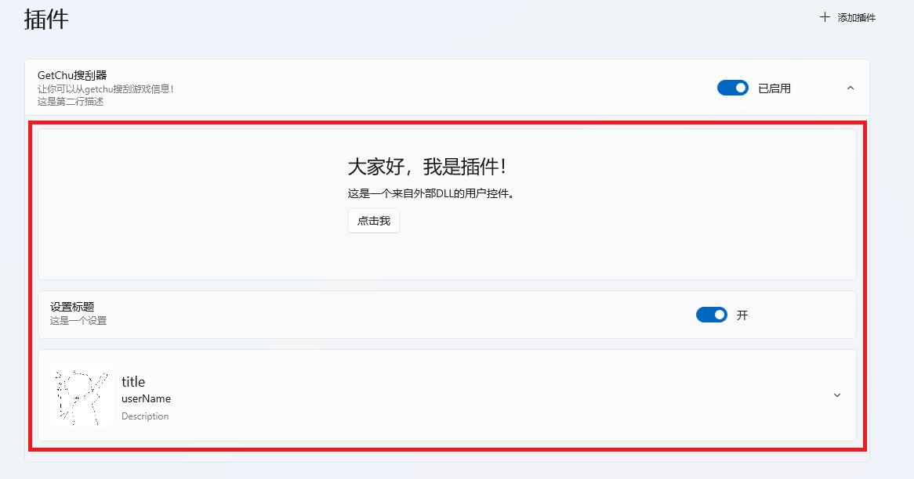

# 插件UI

PotatoVN为插件预留了丰富的插件UI注入接口。

然而，由于 WinUI 3 框架的技术限制，我们无法在一个 XAML 文件中直接嵌套另一个来自不同程序集的 XAML 文件，即插件的XAML文件是不能嵌套另一个XAML的，只能使用WinUI3提供的标准控件。

因此，我们 **强烈推荐** 使用 C# 代码来描述和构建你的插件 UI，而不是使用 XAML。这样做可以绕过框架的限制，让自定义的UI能够相互嵌套，并能保证最佳的兼容性和稳定性。

以下示例代码将生成一个包含设置项和账户面板的 UI：

```csharp
public FrameworkElement CreateSettingUi()
{
    StdStackPanel panel = new();
    panel.Children.Add(new UserControl1().WarpWithPanel());
    panel.Children.Add(new StdSetting("设置标题", "这是一个设置",
        AddToggleSwitch(_data, nameof(_data.TestBool))).WarpWithPanel());
    StdAccountPanel accountPanel = new StdAccountPanel("title", "userName", "Description",
        new Button().WarpWithPanel());
    panel.Children.Add(accountPanel);
    return panel;
}
```
如截图所示，红框部分即为PotatoVN软件本体调用上面的UI注入接口生成的UI：

 

要将你创建的 UI 注入到应用中，请让你的插件主类实现各种 UI 相关的接口。例如，实现 `IPluginSetting` 接口，即可告诉 PotatoVN 你的插件提供了一个设置界面。应用随后会在插件管理页面中调用接口的获取UI的函数并展示这个 UI。