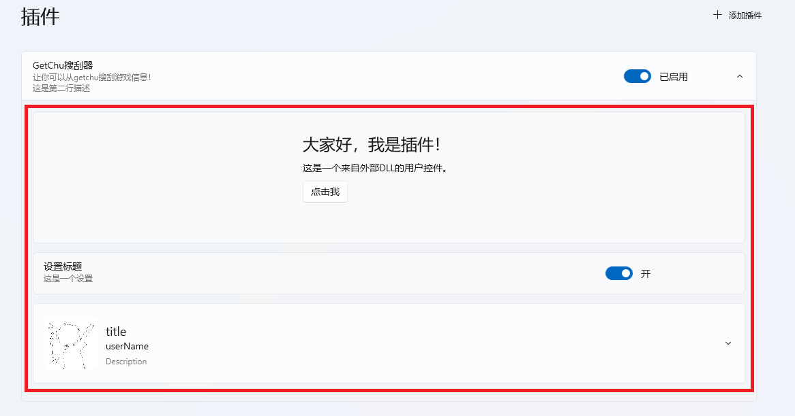

# 插件UI

PotatoVN为插件预留了丰富的插件UI注入接口。

PotatoVN 支持插件使用XAML定义UI（就像常规的WinUI控件那样），也支持使用c#文件直接描述UI。

## XAML描述UI
如果你计划使用XAML来编写UI，请确保以下几点：

1. 插件中的 `Page`、`UserControl`、自定义控件不要直接调用默认生成的 `InitializeComponent()`；请继续使用模板里提供的 `XamlResourceLocatorFactory.PluginControlInit()`（请参考下面的案例）。
2. 插件项目保持 WinUI 类库配置，并启用 `<CopyLocalLockFileAssemblies>true</CopyLocalLockFileAssemblies>`。 (默认模板已启用)
3. 打包插件时要保留生成出来的 `.pri` 文件，以及 `程序集名/...` 这一整套编译后的 XAML 资源目录 （这也是模板默认启用的）。

以下为XAML描述UI的案例：
```xaml
<?xml version="1.0" encoding="utf-8"?>
<UserControl
    x:Class="PotatoVN.App.PluginBase.Controls.TestControl"
    xmlns="http://schemas.microsoft.com/winfx/2006/xaml/presentation"
    xmlns:x="http://schemas.microsoft.com/winfx/2006/xaml"
    xmlns:d="http://schemas.microsoft.com/expression/blend/2008"
    xmlns:mc="http://schemas.openxmlformats.org/markup-compatibility/2006"
    mc:Ignorable="d">
    <Grid>
        <Button Content="Hello World!"/>
    </Grid>
</UserControl>
```

```csharp
using Microsoft.UI.Xaml.Controls;

namespace PotatoVN.App.PluginBase.Controls
{
    public sealed partial class TestControl : UserControl
    {
        //_contentLoaded为UserControl使用XAML描述时自动生成的字段，不需要你自己定义
        public TestControl() => XamlResourceLocatorFactory.PluginControlInit(ref _contentLoaded, this);
    }
}
```

## C#描述UI

如果你计划采用c#描述UI，可以参考以下例子。

以下示例代码将生成一个包含嵌套插件控件、设置项和账户面板的 UI：

```csharp
public FrameworkElement CreateSettingUi()
{
    StdStackPanel panel = new();
    panel.Children.Add(new UserControl1().WarpWithPanel());
    panel.Children.Add(new StdSetting("设置标题", "这是一个设置",
        AddToggleSwitch(_data, nameof(_data.TestBool))).WarpWithPanel());
    StdAccountPanel accountPanel = new StdAccountPanel("title", "userName", "Description",
        new Button().WarpWithPanel());
    panel.Children.Add(accountPanel);
    return panel;
}
```
如截图所示，红框部分即为PotatoVN软件本体调用上面的UI注入接口生成的UI：



要将你创建的 UI 注入到应用中，请让你的插件主类实现各种 UI 相关的接口。例如，实现 `IPluginSetting` 接口，即可告诉 PotatoVN 你的插件提供了一个设置界面。应用随后会在插件管理页面中调用接口的获取UI的函数并展示这个 UI。

游戏详情页支持三类 UI 接口：

- `IGalgamePage`：提供完整自定义详情页，会替换原版详情页主体。
- `IGalgamePageLeftPanel`：向原版详情页左侧面板追加 UI。
- `IGalgamePageRightPanel`：向原版详情页右侧面板追加 UI。

如果只是希望在原版详情页上展示少量信息，优先使用左右面板接口；只有需要完全控制详情页布局时才使用 `IGalgamePage`。
