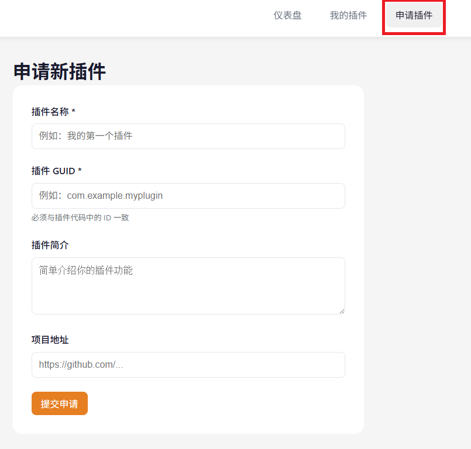

# 使用 AI 开发插件（Vibe Coding）

:::info 给维护者
本页当前的所有 `vibe-*.png` 都是占位图（灰色背景 + "待补充截图"字样）。替换时只需把新截图重命名为同名文件覆盖到 `development/client-plugin/images/` 即可，无需改 markdown 里的图片引用。
:::

:::tip 推荐路径
如果你只是想**快速做出一个能用的插件**，且不想碰 C# / Visual Studio / git 命令行，本章节就是为你准备的。读完后你就能用自然语言在网页上和 AI 协作，把成品发到 PotatoVN 插件市场。
:::

:::warning 两条路径的区别
PotatoVN 插件开发目前有两条互补的路径：

* **手动开发**：本手册后续章节（[快速开始](./quick-start.md)、[项目结构](./project-structure.md)、[Host API](./host-api.md) 等）描述的"装 Visual Studio → 克隆模板 → 自己写 C# → 自己编译"的传统流程。
* **AI 协作开发（Vibe Coding）**：本章节描述的"在网页上用自然语言指挥 AI 帮你写、编译、打包、发布"的流程。

两者产出的是**同一份插件包格式**（`plugin.pvnplugin.zip`）、**同一个插件市场**。你可以全程用 Vibe Coding，也可以先用 Vibe Coding 起骨架、再切到本地 IDE 精修。下面假设你选择全程 Vibe Coding。
:::

## 它能做什么

Vibe Coding 是 PotatoVN 插件平台内置的 AI 协作开发能力。它的核心是一台部署在 Windows 上、装好了 .NET 10 SDK 和编译工具链的后端，搭配一个 AI Agent（基于 [OpenHands SDK](https://docs.openhands.dev/sdk)）。你在网页里描述需求，AI 就会在它的 Windows 工作区里：

* 创建插件项目骨架（基于 [App.PluginBase 模板](https://github.com/PotatoVN-Community/App.PluginBase)）
* 修改 `.csproj` 里的 `<AssemblyName>` 为你插件的 GUID
* 调用 `dotnet build -c Release -r win-x64` 编译插件
* 自动调用 `Compress-Archive` 打包成 `plugin.pvnplugin.zip`
* 把构建产物上传到一个公开可读的仓库，给你一个**直链下载地址**
* 如果运行时出错，能直接读到客户端回传的报错内容并自动修复
* 满意后一键发布到 PotatoVN 插件市场

换句话说，**从"我有个点子"到"玩家在市场里搜到我的插件"，你全程可以不离开浏览器**。

## 准备工作

1. **一个 PotatoVN 账号**：就是你平时用来同步游戏存档的那个账号。没有的话先去 [potatovn.net](https://potatovn.net) 注册。
2. **一个 GitHub 账号（推荐但非必须）**：用于把你的插件源码托管到 GitHub，方便后续版本管理、多设备协作、或者切回本地 IDE 精修。如果你完全不想碰 GitHub，也可以让 AI 在云端工作区里开发，不连接远端仓库——但这样的话源码只存在于 Vibe Coding 服务器上，**建议至少在发布前连一次 GitHub 把代码拉回本地备份**。
3. **可选：自己的 AI API Key**：平台默认提供一个共享 AI（每月每用户 200M tokens 免费额度），够日常开发用。如果你想用更强的模型或更多额度，可以在设置页填入自己的 API Key（Anthropic / OpenAI / DeepSeek / 阿里通义等均支持），用了自己的 Key 不消耗免费额度。

## 整体流程

整个 Vibe Coding 的流程可以用下面这张图概括：


下面按步骤展开。

## 第一步：在插件平台申请插件

:::tip
如果跳过本节直接去 Vibe Coding 页面，你会看到一个"还没有插件"的空状态，点"创建新插件"也会跳回这里——所以这一步是必经的。
:::

登录 [PotatoVN 插件平台](https://plugin.potatovn.net)，点击右上角的`创建插件`按钮，填写插件名称和简介后提交申请。一般土豆会在 3 天内审核通过。



审核通过后，你会在"我的插件"里看到这个插件项目。这一步只是给插件**登记一个身份**（拿到 GUID），还没开始写代码。

## 第二步：进入 Vibe Coding

在"我的插件"界面，每个插件卡片上都会有一个进入 Vibe Coding 的入口。点击对应插件即可进入该插件的 Vibe Coding 工作区。


进入后你会看到一个三栏式的对话界面：

* **左栏**：会话列表 + 模型选择器 + 思考强度选择器 + 工作区/GitHub/技能入口
* **中间**：消息流（你和 AI 的对话、AI 调用工具的过程都会实时显示在这里）
* **右栏（折叠态）**：任务清单（AI 会把你的需求拆成多个子任务并标记进度）
* **顶栏**：本月默认额度进度条、LLM 设置入口、返回插件管理


### 首次进入：选择代码来源

如果一个插件是**新创建的**（Vibe Coding 服务器上还没有它的源码工作区），你会看到一个入口选择弹窗，让你二选一：


* **连接 GitHub 并同步仓库**：你已经在 GitHub 上有了一个插件仓库（比如之前手动用 [App.PluginBase 模板](https://github.com/PotatoVN-Community/App.PluginBase) 创建过一个），想让 AI 接手继续改。点击后会引导你安装 PotatoVN 的 GitHub App 并选择对应仓库。
* **创建全新的插件**：让 AI 在服务器上从模板克隆一份全新的空白骨架开始写。适合从零开始的新插件。

:::info 已有工作区怎么办
如果一个插件**之前已经在 Vibe Coding 里开发过**（服务器上已经有它的工作区），这个入口弹窗不会出现，会直接进入会话界面。你可以继续之前的对话，也可以开新对话。
:::

### 连接 GitHub（可选但推荐）

点击左栏的`GitHub`按钮可以打开 GitHub 面板。Vibe Coding 支持两种鉴权方式连接 GitHub：


1. **GitHub App（推荐）**：点击安装链接，授权 PotatoVN 的 GitHub App 访问你账号下的仓库，然后选择你想连接的仓库。这样 AI 既能 pull 也能 push，且不需要你手动管理 token。
2. **Personal Access Token (PAT)**：如果你不想用 GitHub App，可以生成一个有 `repo` 权限的 fine-grained PAT 粘贴进来。

连接成功后，AI 就能：

* 把 GitHub 仓库的内容 pull 到工作区
* 在 AI 修改代码后，按你的指示 commit + push 回 GitHub
* 切换分支、解决冲突

如果你打算把插件源码长期托管在 GitHub 上，强烈建议在开始写代码之前就连好。

## 第三步：配置 AI（可选）

点击顶栏的`LLM 设置`链接进入 LLM 配置页。

### 使用平台默认 AI

什么都不配置，默认就会用平台提供的共享 AI（目前是 Claude Sonnet 4.5，可能根据运营调整）。每月每用户有 200M tokens 的免费额度，顶栏的进度条会显示当月用量。200M tokens 大约能支撑几十轮完整开发对话，对个人开发者来说日常够用。


### 用自己的 AI Key（BYOK）

如果你有自己的 API Key，可以点`新建 Profile`添加一个：

* **Provider**：下拉选你的 AI 提供商（OpenAI / Anthropic / DeepSeek / 通义千问 / Moonshot / 智谱 / ...），或选"自定义"手动填
* **Base URL**：留空用默认；如果你用第三方代理或自建网关，填在这里
* **API Key**：填你的密钥（会用 AES 加密存到后端数据库，前端不再回显）
* **Model**：填具体的模型 ID，比如 `anthropic/claude-sonnet-4-5-20250929`、`deepseek/deepseek-chat`
* **Discover Models**：如果你的 provider 兼容 OpenAI `/v1/models` 协议，点这个按钮可以自动列出账号下可用的模型

:::tip 配额说明
用平台默认 AI 会消耗免费额度（每月 200M tokens，超出后本月不能再发新消息，下月自动恢复）。用自己的 Key **不消耗免费额度，也不限量**——成本由你自己承担。
:::

创建好的 Profile 会在会话界面的模型选择器里出现，随时切换。

### 思考强度

在会话界面左栏还有一个`思考强度`选择器（仅对支持 reasoning 的模型生效）。档位从低到高：

* `关闭`：不启用 reasoning
* `极低 / 低 / 中 / 高 / 极高`：思考强度越高，AI 在动手前"想"得越久，复杂任务的成功率越高，但消耗 token 也越多

对于"帮我从零做一个完整插件"这种复杂任务，建议用`高`或`极高`；对于"把这个按钮的文字改成你好"这种小改动，用`低`或`中`即可。

## 第四步：和 AI 对话开发

这是 Vibe Coding 的核心环节。在底部的输入框里用自然语言描述你想做什么，按`Enter`发送（`Shift+Enter`换行）。

### 写第一条消息

一个比较好的第一条消息应该包含：

* **你想做什么**：一句话说清插件的核心功能
* **目标场景**：在 PotatoVN 的哪个界面、什么时机触发
* **如果有参考**：贴一张你想模仿的界面的截图

比如：

> 帮我做一个插件，在每次对话开始时弹出一个 hello 提示框，并且加一个开关让用户能在设置里关掉这个提示。最后构建一个包给我下载试试。

如果你有参考图，直接把图片拖进输入框、或者`Ctrl+V`粘贴剪贴板里的截图，AI 也能看（前提是你选的模型支持视觉，Claude / GPT-4o / Gemini 都支持）。


### AI 在做什么

你发完消息后，会看到 AI 开始"思考中"，然后陆续调用一系列工具。每一步都会以可折叠卡片的形式实时显示在消息流里：

* 📝 **str_replace_editor / FileEditorTool**：AI 在创建或修改文件
* 💻 **TerminalTool**：AI 在执行 shell 命令（比如 `dotnet build`、`git add`）
* 🥔 **build_plugin**：AI 调用 PotatoVN 专用 MCP 工具，跑一次完整的 `dotnet build -c Release -r win-x64`，产出 `plugin.pvnplugin.zip`
* 📦 **upload_test_build**：把构建产物上传到公开仓库，返回下载链接
* 🔧 **set_plugin_assembly_name**：把 `<AssemblyName>` 改成你插件的 GUID 对应的格式
* 🔗 **git_commit_and_push**：把改动推回 GitHub（如果连了）
* 📋 **task_tracker**：AI 把任务拆成多步并实时更新进度，右栏任务清单会同步显示

每个工具卡片都可以点`详情`展开看完整的入参和输出（命令行、diff、退出码等）。如果你对 AI 的某一步有疑问，展开看一下输出往往能找到答案。

### 查看工作区文件

点击左栏的`工作区`按钮可以打开工作区面板，以文件树的形式浏览 AI 在服务器上写的所有文件。点击文件可以预览内容、查看 git diff、看 git log。文本文件还可以直接在网页里手动编辑（仅当 AI 没在跑的时候）。


:::warning 编辑锁
当 AI 正在跑（会话处于"运行中"状态）时，工作区写接口会被锁定（返回 423 Locked），避免你手改和 AI 改冲突。等 AI 跑完再编辑。
:::

## 第五步：拿到试构建包并测试

当 AI 完成一次完整的 `build_plugin` + `upload_test_build`，你会看到两件事：

1. 消息流里 AI 会贴出一个下载链接（通常是 `https://plugin.api.potatovn.net/api/universal/...` 这样的直链）
2. 会话界面右上角的`试构建产物`面板会出现一条新记录，带`下载`、`发布`、`sha256`、`删除`按钮


点`下载`把 `plugin.pvnplugin.zip` 存到本地，然后：

1. 打开 PotatoVN 客户端
2. 设置 → 其他设置 → **开启开发者模式**
3. 插件界面 → 右上角开发者专用按钮 → 选刚才下载的 zip（或者解压后的文件夹）
4. 启用插件，触发一次它应该工作的场景，看看效果

:::info 试构建 vs 正式发布
试构建产物存在一个**公开可读**的共享仓库 `plugin-vibe-dev` 里，任何拿到链接的人都能下载。这是为了方便你发给朋友测试。**正式发布**走的是另一个私有仓库 `plugin-<你的GUID>`，会经过审核、出现在插件市场里——见第七步。
:::

## 第六步：让 AI 修 bug

测试时如果插件崩了或者行为不对，你有两种方式让 AI 修：

### 方式 A：手动把错误信息贴给 AI

最直接：把客户端弹的错误、或者你看到的不对劲的现象，用文字描述发给 AI。比如：

> 我启用了插件，但是没看到 hello 弹窗，控制台报了 `System.NullReferenceException at HelloPlugin.Entry.OnEnabled()`，看看为什么

如果能把错误截图直接粘进输入框更好，AI 能直接看到。

### 方式 B：让客户端自动上报错误（高级）

PotatoVN 提供了一个运行时报错上报接口，插件端调用后错误内容会自动出现在 Vibe Coding 的`最近运行错误`面板里，AI 也能直接读到——不需要你手动复制粘贴。

会话界面右上角的`最近运行错误`面板会列出该插件所有未消费的报错。点`复制上报 curl`可以拿到一个 curl 命令模板，里面包含这个插件专用的上报 URL：


```bash
curl -X POST "https://plugin.potatovn.net/api/vibe/plugins/<你的插件GUID>/runtime-errors" \
  -H "Content-Type: application/json" \
  -d '{
    "plugin_version": "local-test",
    "error_type": "Exception",
    "message": "在这里填错误信息",
    "stack_trace": "在这里填调用栈",
    "context": { "source": "manual" }
  }'
```

:::info 插件 SDK 一键上报
第一阶段 PotatoVN 客户端还没有内置 `PvnVibe.Report(error)` 这样的 SDK 函数，需要你自己用 HTTP 请求上报。后续会在插件 SDK 里加一键上报函数，届时一行代码就能把错误推给 Vibe Coding。
:::

报错上报后，在对话里告诉 AI：

> 看看最近的运行错误，修一下

AI 会自动调用 `get_runtime_errors` 工具拉取最新报错，定位代码、修复、重新构建、给你新的下载链接——全程不用你复制错误内容。

## 第七步：发布到插件市场

试构建测试满意后，就可以正式发布到 PotatoVN 插件市场了。

在`试构建产物`面板里，对应构建记录上有一个`发布`按钮。点击后会让你填：

* **版本号**：默认会基于当前最新版本号 +1 个 patch（比如 `0.0.1` → `0.0.2`），你也可以手动改。版本号必须严格大于当前已发布的最大版本号，否则发布会被拒绝。
* **更新说明**：可留空，建议填一下这次改了啥


确认后，AI 会调用 `publish_plugin` MCP 工具，走完整的发布链路：

1. 从试构建仓库取出刚才的 `plugin.pvnplugin.zip`
2. 上传到正式仓库 `plugin-<你的GUID>`
3. 在 Plugin.Web 数据库写入 `plugin_versions` 记录
4. 自动创建一个发布审核申请

:::warning 第一次发布需要审核
和手动发布一样，**第一次**上传插件包需要等土豆审核通过后才能在客户端插件市场里搜到。后续版本更新不需要再审核。
:::

发布成功后会弹出一个绿色的`发布成功：x.y.z`提示。此时你可以：

* 在 PotatoVN 客户端的插件市场里搜到你的插件
* 在插件平台的"我的插件"详情页 → 版本管理里看到新的版本记录
* 继续开新对话开发下一版功能

## 常见操作速查

| 你想做的事 | 在哪里做 |
|---|---|
| 看本月免费额度还剩多少 | 顶栏进度条 |
| 切换 AI 模型 | 左栏模型选择器 |
| 调整思考强度 | 左栏思考强度选择器 |
| 开新对话（保留之前的） | 左栏`+ 新对话` |
| 重命名 / 删除会话 | 左栏会话条目右边的`⋯`菜单 |
| 看 AI 改了哪些文件 | 左栏`工作区` → 文件树 / git diff |
| 手动改一个文件 | 左栏`工作区` → 选中文件 → 编辑（AI 闲置时） |
| 连接 / 切换 GitHub 仓库 | 左栏`GitHub` |
| 把改动推回 GitHub | 在对话里说"提交并推送到 github" |
| 下载试构建包 | 右上角`试构建产物`面板 →`下载` |
| 删除一个试构建 | 右上角`试构建产物`面板 →`删除` |
| 发布到市场 | 右上角`试构建产物`面板 →`发布` |
| 看本次会话 AI 调用工具的审计 | 顶栏`审计`按钮 |
| 查看/管理自己的 AI Key | 顶栏`LLM 设置` |
| 管理 AI 技能（高级） | 左栏`技能`按钮 |

## 和手动开发的关系

Vibe Coding 产出的插件包和手动开发产出的**完全一样**——都是 `plugin.pvnplugin.zip`、都是基于 [App.PluginBase 模板](https://github.com/PotatoVN-Community/App.PluginBase) 编译出来的。两种方式可以混用：

* **用 Vibe Coding 起骨架**，然后连上 GitHub，在本地用 Visual Studio / Rider 打开同一个仓库精修细节（比如复杂的 WinUI XAML 布局）
* **手动开发遇到瓶颈**，把仓库连到 Vibe Coding，让 AI 帮你查 bug、补单元测试、写文档
* **发布一定要走插件平台**，无论代码是 AI 写的还是你写的，最终都通过`试构建产物 → 发布`或手动走[发布与版本管理](./deploy-manage.md)章节的流程上架

后续章节会深入讲插件开发的各个技术细节（[项目结构](./project-structure.md)、[Host API](./host-api.md)、[插件 UI](./ui.md) 等）。如果你完全依赖 Vibe Coding，这些章节可以按需查阅——遇到 AI 改不动的细节问题时，了解一下插件项目结构往往能帮你写出更精准的指令。

:::tip 写好指令的小技巧
* 描述**目标场景**而不是实现方式：说"在游戏详情页右下角加一个收藏按钮"比"加一个 Button 控件到 Grid 的第三行第三列"更好，前者让 AI 自己决定布局，后者把你绑死在具体实现上
* 一次只交代一个核心功能：AI 一次能做的事有限，复杂插件拆成多轮对话逐个加功能比一次塞太多更可靠
* 出问题先贴报错：比起描述"它不工作"，把客户端控制台的报错原文贴给 AI（或让客户端自动上报）效率高 10 倍
* 善用 GitHub：连了 GitHub 后，每次 AI 改完你都能在 GitHub 上看到 diff，方便 review 和回滚
:::