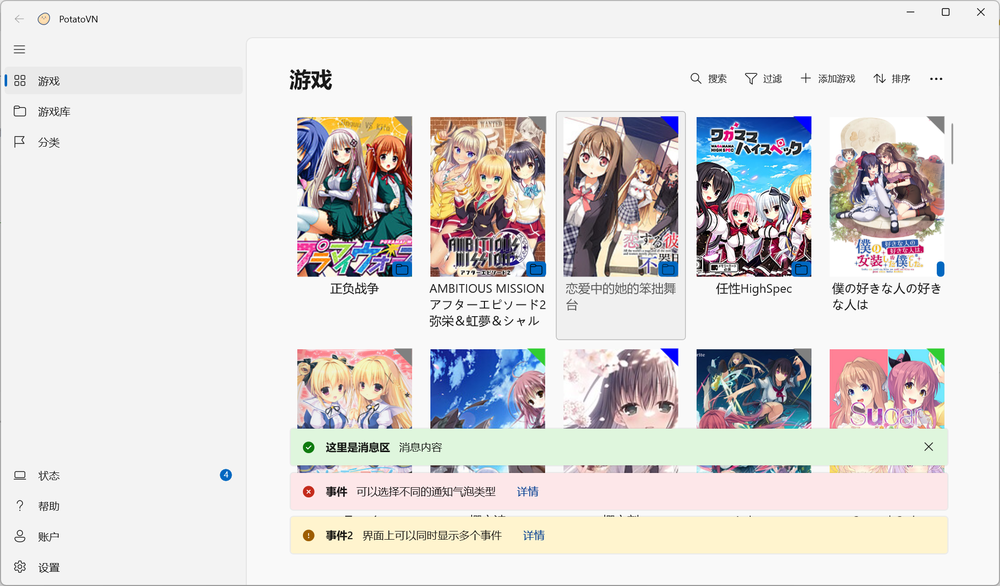
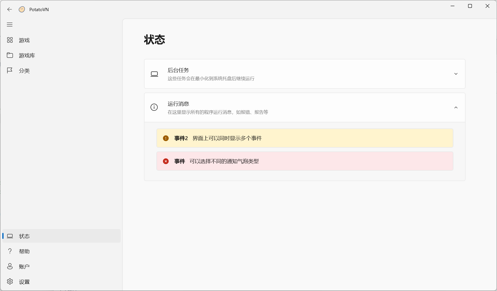


# 消息、事件、报错
PotatoVN 采用统一的通知机制，通知分为两种类型：消息与事件。



所有通知均需调用`InfoService`发送，你可以任何地方使用`App.GetService<IInfoService>`获取`InfoService`实例，
或是使用依赖注入的方式注入`IInfoService`。

## 消息
消息仅会在当前页面显示，且不会记录到状态中心中，消息通常用于提示用户一些临时性的信息或用来显示某些操作的进度。

当页面切换的时候，消息会被清空。

调用```infoService.Info```来发送消息。

```cs
//例：帮助界面使用消息通知用户正在获取FAQ
private void ChangeInfoBar()
    {
        if (_faqService.IsUpdating)
            _infoService.Info(InfoBarSeverity.Informational, msg: "HelpPage_GettingFaq".GetLocalized(),
                displayTimeMs: 100000);
        else
            _infoService.Info(InfoBarSeverity.Informational); // 关闭InfoBar
    }
```


## 事件
事件一般用于通知用户某个操作的结果或是报错，其会被记录到状态中心中，如下图所示。



调用```infoService.Event```来发送事件。

事件有提醒与不提醒事件两种，对于提醒的事件，其会像本页头图那样显示在页面底部，同时左侧的状态中心未读数量会加一；
对于不提醒的事件，其只会记录到状态中心中，不会显示在页面底部。且不会影响状态中心未读数量。

可以在`InfoService`的`ShouldNotifyEvent`函数中判断事件是否要提醒（一般为读取设置）

特别的，有一种事件类型为开发者事件，其只会在设置中打开了开发者模式时才会被设置为提醒事件。
该事件一般用于没那么严重的异常，但又不希望直接return掉的情况,用于在某个事情没有成功时用户可以打开该选项从而便于开发者快速定位问题来源。

可以调用`InfoService`的`DeveloperEvent`来便捷的触发开发者事件。

