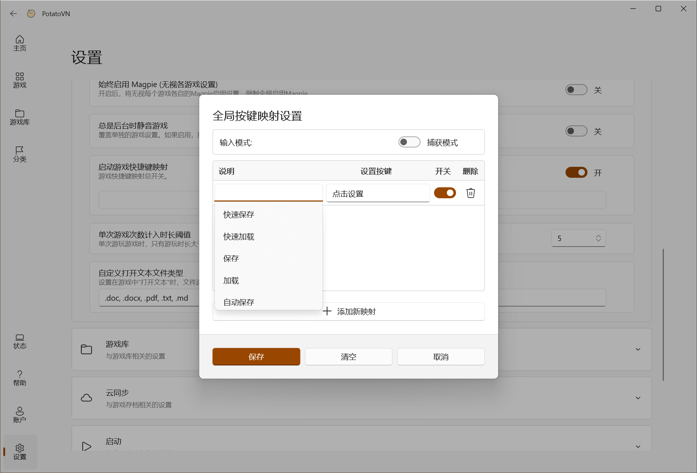
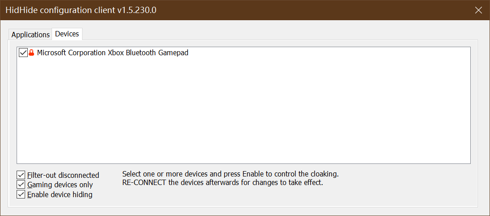
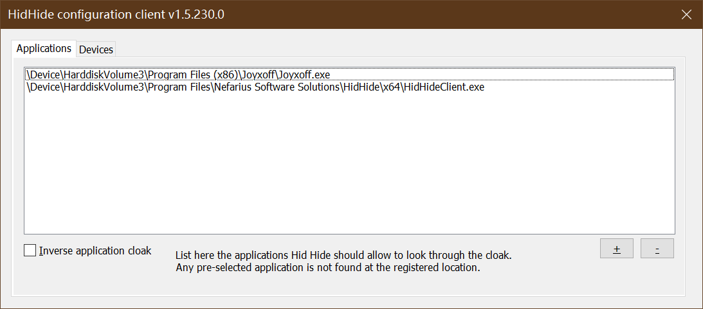

# 按键映射

PotatoVN 提供了**按键映射**功能，旨在解决不同 Galgame 快捷键不统一的问题。通过此功能，您可以设置一套自定义的快捷键方案，应用会自动将其映射到游戏内的操作，让您无需再记忆每个游戏不同的按键设置。

## 如何使用

### 1. 设置快捷键

您可以在以下两个位置找到按键映射的设置入口：
*   **全局设置**：`设置\游戏\启动游戏快捷键映射`。此处设置的映射将作为默认方案应用于所有游戏。
在这里可以添加说明以及设置 **你喜欢的快捷键**

*   **单独游戏设置**：在游戏详情页面 `编辑\游戏设置\按键映射`中，点击“按键映射”按钮。此处可以为当前游戏单独配置映射，

### 2. 添加/编辑映射

在按键映射界面中：
1.  **添加映射**：点击“添加”按钮创建新的映射规则。**全局中设置的按键会自动导入**
2.  **输入快捷键**：
    *   **直接录入**：点击输入框，直接按下您想要使用的键盘按键或鼠标按钮。
    *   **列表选择**：如果按键难以直接录入（如特殊功能键），您可以点击输入框旁的列表图标，从下拉菜单中选择按键。
3.  **游戏中按键**：设置该快捷键对应触发的游戏内原始按键。**（最关键）** 这样才知道如何映射
4.  **保存**：设置完成后，请务必点击“保存”按钮。

### 3. 启用/禁用

*   您可以在设置界面随时开启或关闭按键映射功能。
*   只有在功能开启状态下，通过 PotatoVN 启动游戏时才会生效。

## 手柄使用指南

PotatoVN 的按键映射功能主要针对键盘和鼠标操作。如果您希望使用手柄进行游戏，可以参考以下步骤：

### 1. 手柄映射至键盘

由于 Galgame 普遍不支持手柄，建议您使用第三方手柄映射工具（例如 [JoyXOff](https://joyxoff.com/en/)）将手柄的输入映射到键盘按键。这样，PotatoVN 就可以通过键盘按键捕获手柄的输入并进行映射。

### 2. 解决手柄双重输入问题

在部分情况下，将手柄映射到键盘后，游戏可能会同时接收到手柄的原始输入和模拟的键盘输入，导致双重输入问题。为了解决此问题，您可以使用 [HidHide](https://github.com/nefarius/HidHide) 等工具来隐藏原始手柄输入，确保游戏只接收到模拟的键盘输入。

**使用 HidHide 的步骤概要：**
1.  下载并安装 [HidHide](https://github.com/nefarius/HidHide)
2.  运行 HidHide Configuration Client。
3.  在`Devices`选项卡中，勾选您想要隐藏的手柄。请保证下面的3个勾全部打勾同时再**重连**一次

4.  在`Applications`选项卡中，添加上面的映射软件，例如 [JoyXOff](https://joyxoff.com/en/)，
- 默认是`白名单`制，只有名单中的程序看得到手柄。
- 可以点击下方的 Inverse 使用`黑名单`制，这时需要添加的就是游戏的程序

 

通过上述步骤，您将能够更顺畅地使用手柄玩 Galgame，同时避免双重输入。

## 常见问题

*   **生效条件**：按键映射功能通过键盘钩子实现，需要保持 PotatoVN 在后台运行。
*   **兼容性**：该功能已在 Yuzusoft 等社的游戏上进行测试，支持大多数标准的 Galgame。