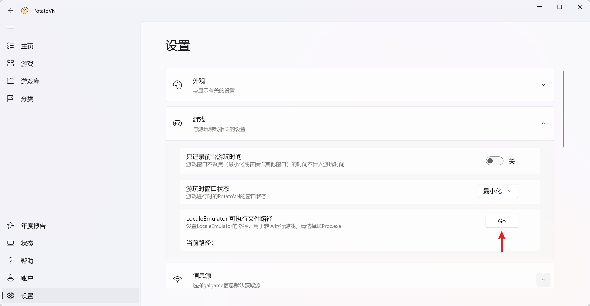
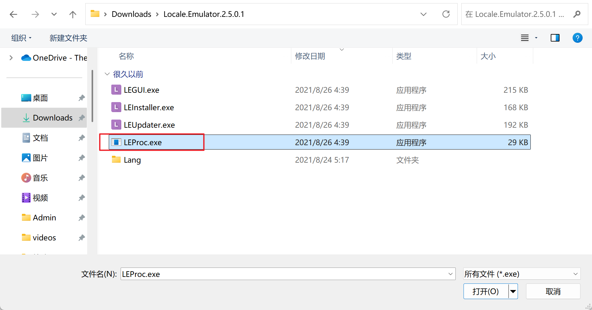
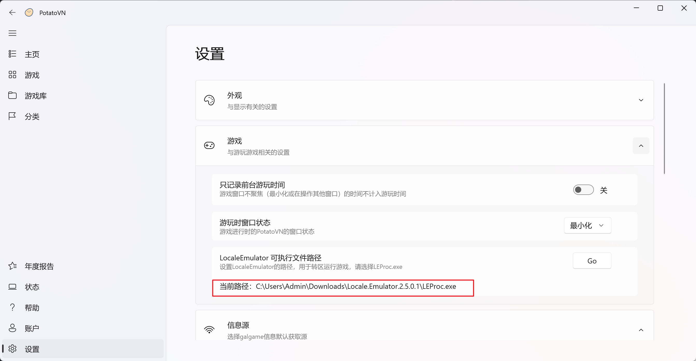
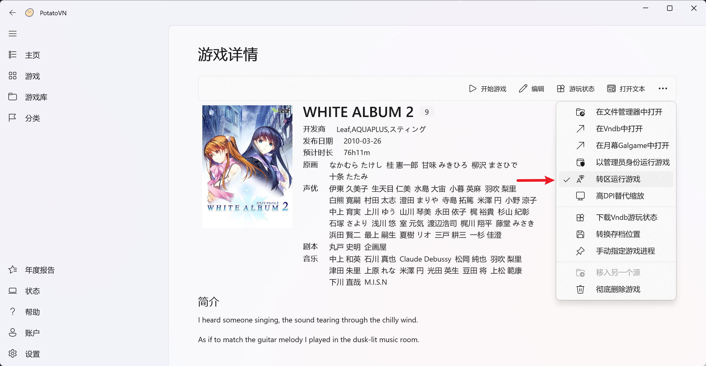

---
order: 5
---

# LocaleEmulator支持

## STEP1
在游戏的`设置\游戏\LocaleEmulator 可执行文件路径`中点击`Go`按钮

## STEP2
选择LocaleEmulator根目录下的`LEProc.exe`文件

设置完成后会显示当前路径

## STEP3
在游戏界面勾选`转区运行游戏`选项即可在每次运行游戏时使用LocaleEmulator运行游戏

搞好啦，撒花~
