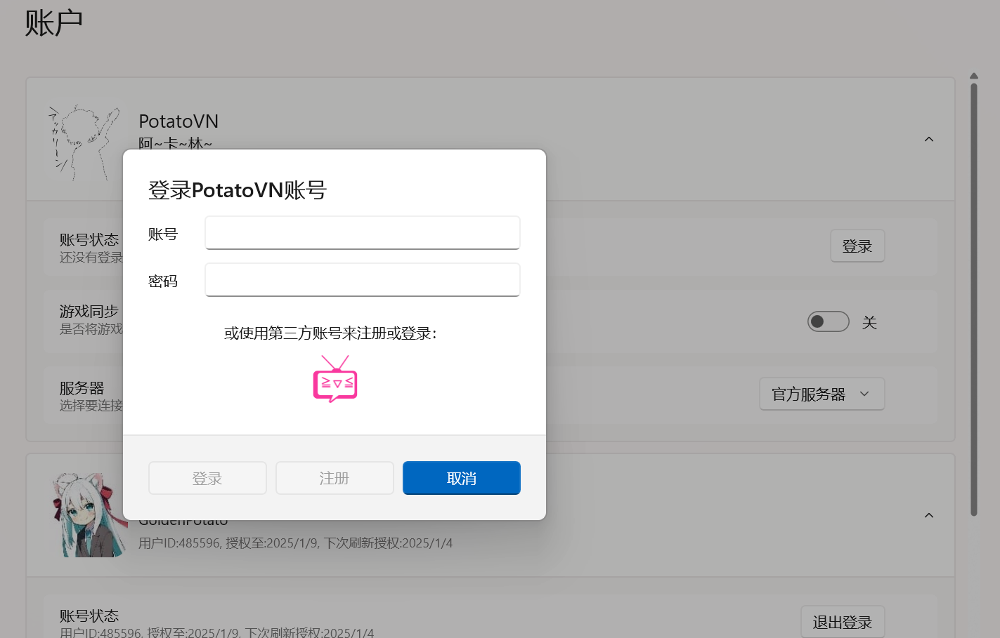

# 同步服务

PotatoVN 免费提供默认最大上传图片容量100MB（用来存储同步游戏封面，足够存储接近1000个游戏）的游戏同步功能。

希望能部署自己的同步服务器？[参考这里](/usage/advance/deploy-server.md)

:::tip
PotatoVN免费提供所有正常需求的容量，100MB的默认限制只是为了防止滥用。如果100MB容量对你来说不够用，欢迎邮件联系：[goldenpotato137@gmail.com](mailto:goldenpotato137@gmail.com)，请在邮件中标注你的PotatoVN ID，goldenpotato137（开发者）会帮你扩到你需要的容量~
:::

:::info
虽然goldenpotato137非常希望能够确保服务器的正常运行，但由于各种各样可能的意外情况（~~没钱租服务器~~（短期内不太可能发生，已经续费到2027年了捏）、服务器被攻击、服务器被墙、人太多把服务器挤爆了等），服务有可能不可用。

强烈推荐[**定期手动导出数据**](/usage/advance/data-exchange.md#导入-导出)，保护数据安全
:::

PotatoVN同步服务器可以同步包括游戏列表、游玩记录等内容，请移步[此页](/usage/advance/data-exchange.md)查看具体能同步的内容。

## 使用指北

要使用PotatoVN服务器，首先需要注册一个PotatoVN账号（如果你计划使用官方服务器，或[自行部署服务器](/usage/advance/deploy-server.md)。

打开账户界面，点击登录按钮，**推荐使用bangumi账户来登录或注册**，或输入账户密码来登录或注册：

完成登录后，打开游戏同步的开关即可同步游戏、游玩数据等信息。