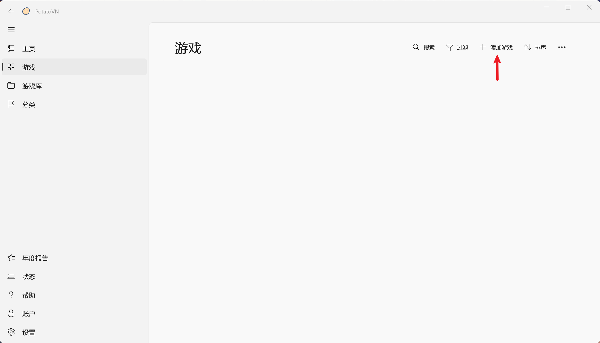
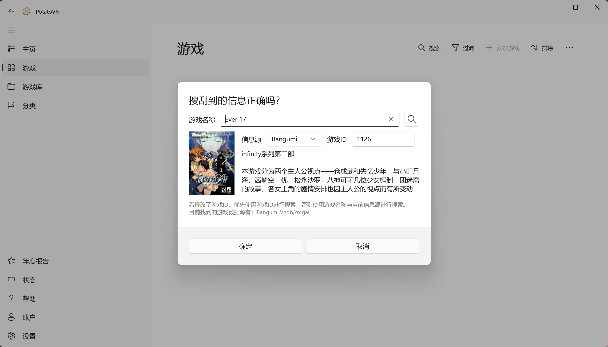
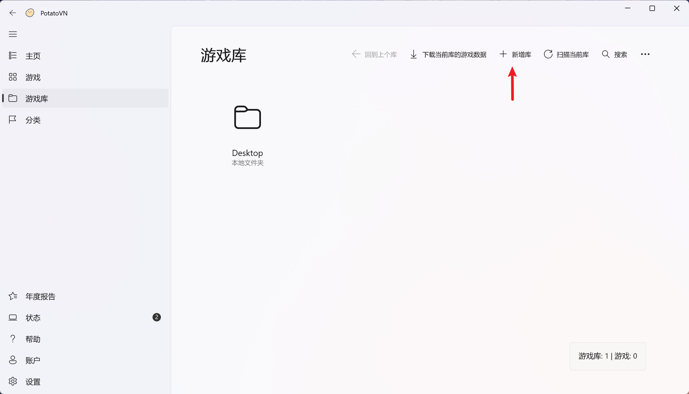
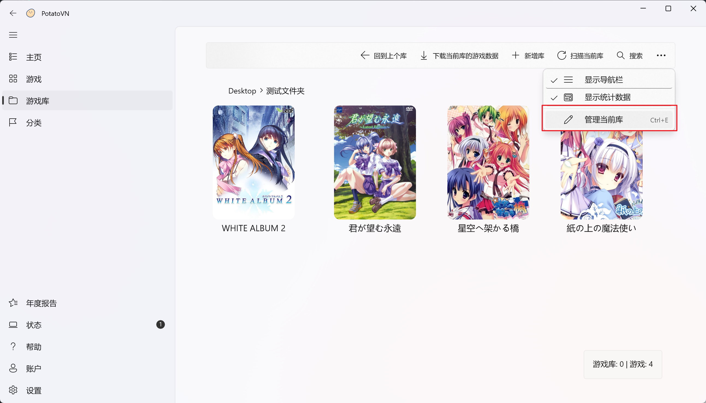
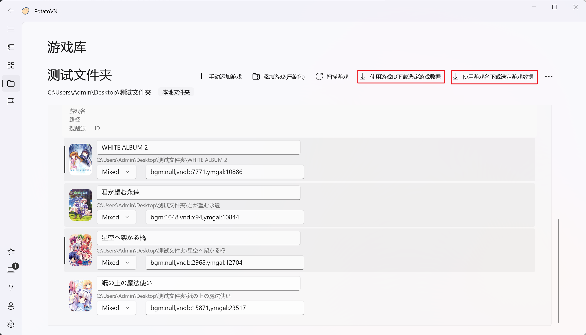
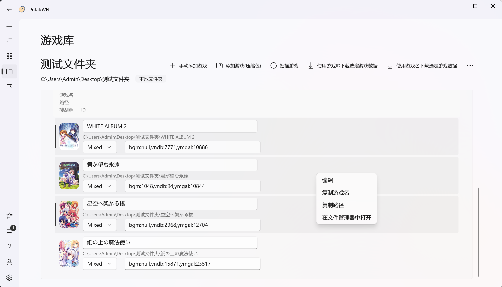

# 导入游戏

PotatoVN 提供了灵活的游戏导入方式，支持单个游戏导入和批量导入（游戏库）功能。

导入游戏时，PotatoVN 会自动将游戏文件夹名称作为默认游戏名，并在配置的信息源中搜索匹配的游戏信息。如果找到对应信息，系统会自动填充相关数据，用户也可手动修改这些信息。

## 导入单个游戏

导入单个游戏有以下两种方式：

-  在`游戏`界面点击`添加游戏`按钮，然后选择游戏的运行文件（支持`.exe`和`.bat`格式）

-  直接将游戏的运行文件或游戏所在文件夹拖拽到`游戏`界面
<!--  -->

操作后，PotatoVN 会弹出信息窗口显示获取到的游戏数据。您可以：
- 修改游戏名称并在选定的信息源中进行模糊搜索
- 输入精确的信息源对应的游戏ID进行精确匹配


点击确认后，游戏将被添加到游戏列表并可在`游戏库`中找到

**支持的信息源**：
- [Bangumi](https://bgm.tv) - 综合动漫及游戏数据库（需登录获取更多游戏信息）
- [VNDB](https://vndb.org) - 全球视觉小说数据库（大部分游戏信息为英文）
- [Ymgal](http://ymgal.games) - 国内Galgame资源社区
- [Cngal](https://cngal.org) - 国产Galgame专业数据库（仅支持国产游戏）

要获取游戏ID，可访问上述网站搜索游戏，从地址栏中提取数字ID（例如：`https://bgm.tv/subject/62229`中的`62229`）。

详情请见[信息源](./../how-to-use/pharser.md)。


## 批量导入游戏（游戏库）

PotatoVN 支持将多个游戏整合到一个文件夹（游戏库）进行批量导入和管理，极大提升效率。

### 游戏库目录结构


::: info

**单层结构**
```
游戏库
  ├─ 游戏A
  │   ├─ 运行文件.exe
  │   └─ 其他文件
  ├─ 游戏B
  ├─ 游戏C
  └─ 游戏D
```

**嵌套结构**
```
游戏库
  ├─ 游戏A
  │   ├─ 运行文件.exe
  │   └─ 其他文件
  ├─ 游戏B
  ├─ 游戏C
  └─ 二级游戏库
      └─ 游戏D
          ├─ 运行文件.exe
          └─ 其他文件
```
:::

> [!IMPORTANT]
> - 默认情况下，系统只扫描一级子目录
> - 要识别嵌套结构中的游戏，请在`设置\游戏库\递归搜索子目录`中启用相关选项
>

**游戏识别规则**：
系统将文件夹识别为游戏的条件是：包含.exe文件，同时至少包含以下任一文件类型：
- .xp3、.arc、.dat、.ini、.dll、.txt
- .pac、.noa、.sh、.bin、.pck

您可以在`设置\游戏库\游戏匹配规则`中自定义这些匹配条件。


点击`游戏库`界面的`新增库`来添加游戏库，然后选择对应文件夹，PotatoVN会自动扫描文件夹内所有符合规则的子文件夹，并在`状态`列显示实时扫描进度



添加完成后，新游戏库会显示在`游戏库`界面中：

**游戏信息管理**：
如果库中游戏信息识别有误，您可以：
1. 右键点击游戏库→选择`修改库`，进入批量编辑模式，修改当前库中所有游戏的信息

1. 修改游戏名或游戏ID，选中后点击上方按钮进行搜索，获取的信息会实时保存


**操作技巧**：
- 使用`Ctrl`或`Shift`键多选游戏
- 使用`Ctrl+A`全选所有游戏
- 右键点击游戏可执行更多快捷操作


::: tip
- 可在`设置\下载行为\覆盖名字`中设置是否使用信息源的游戏名覆盖游戏名
- 可在`设置\游戏库\忽略游戏查询结果`中设置将没有在信息源中找到的游戏加入到游戏库中
- 可在`设置\信息源\Mixed`中设置使用混合信息源搜索游戏信息的优先级
:::