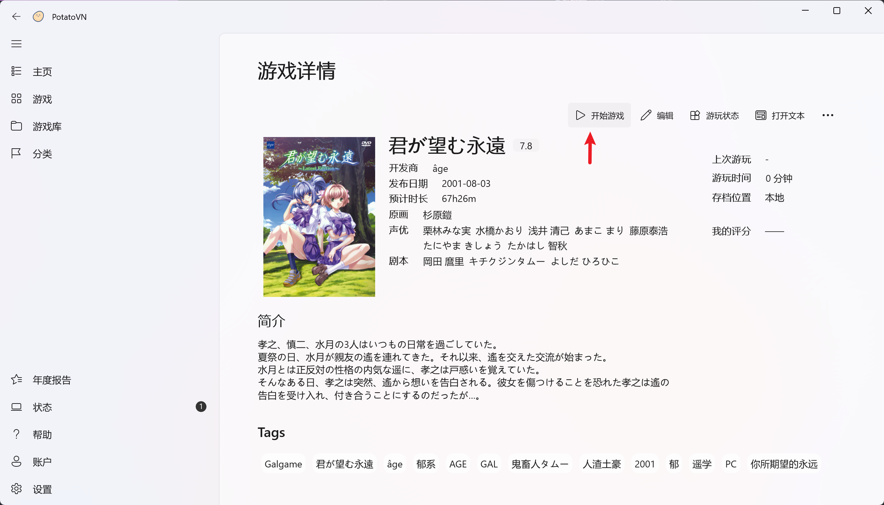
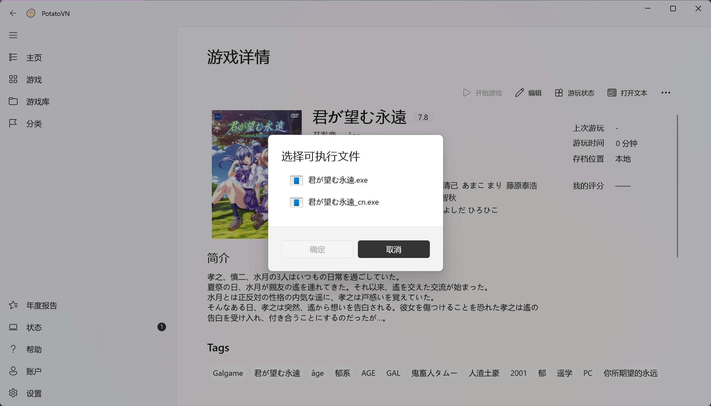
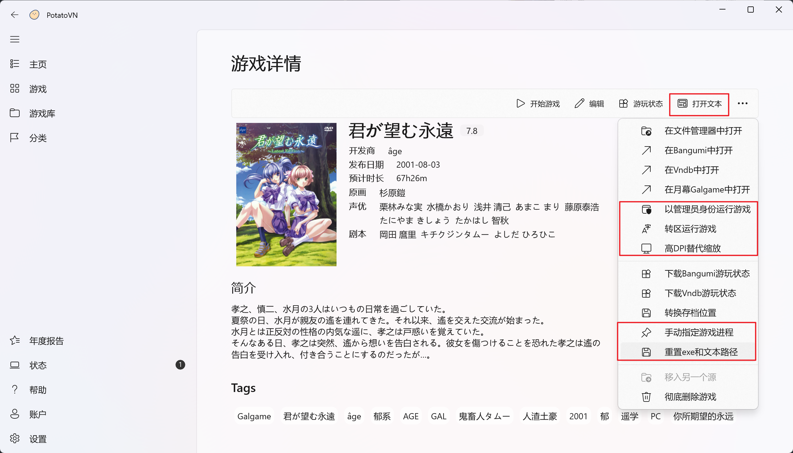
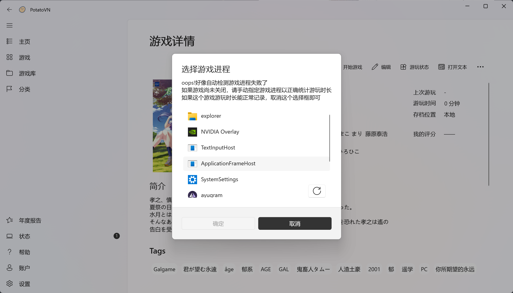

# 启动游戏

在游戏详情页面，只需点击`开始游戏`按钮即可启动游戏。

## 首次运行

- 首次运行游戏时，系统会弹窗提示您选择游戏运行文件（通常是`.exe`文件）

- 如果游戏文件夹内仅有一个可执行文件，系统将自动选择该文件并直接启动游戏

## 高级选项

PotatoVN提供多种高级功能，以满足不同游戏的运行需求：

| 选项 | 功能描述 |
|------|---------|
| **打开文本** | 快速打开游戏文件夹下的文本文件，方便查阅游戏说明、攻略等信息 |
| **以管理员身份运行游戏** | 提升游戏运行权限，解决部分游戏因权限不足无法正常运行的问题 |
| **转区运行游戏** | 使用Locale Emulator工具转区运行游戏，有效解决部分游戏出现乱码的问题 |
| **高DPI替代缩放** | 解决游戏在高分辨率屏幕下显示模糊的问题，提升视觉体验 |

如果不慎选择了错误的游戏运行文件，可点击`重置exe和文本路径`按钮，重新初始化游戏运行文件和文本文件路径。

## 游戏运行流程

1. 点击`开始游戏`按钮后，PotatoVN将启动游戏并自动在后台监控游戏进程
2. 系统会记录您的游戏运行时间，用于统计和管理，您可以点击`游玩时间`来查看游戏运行时长详情

### 进程监控问题处理

当PotatoVN无法自动识别游戏进程时：
- 系统会自动弹出窗口，引导您手动选择正确的游戏进程
- 如遇系统未弹窗但游戏进程识别错误的情况，您可以随时点击`手动选择游戏进程`按钮进行手动选择

